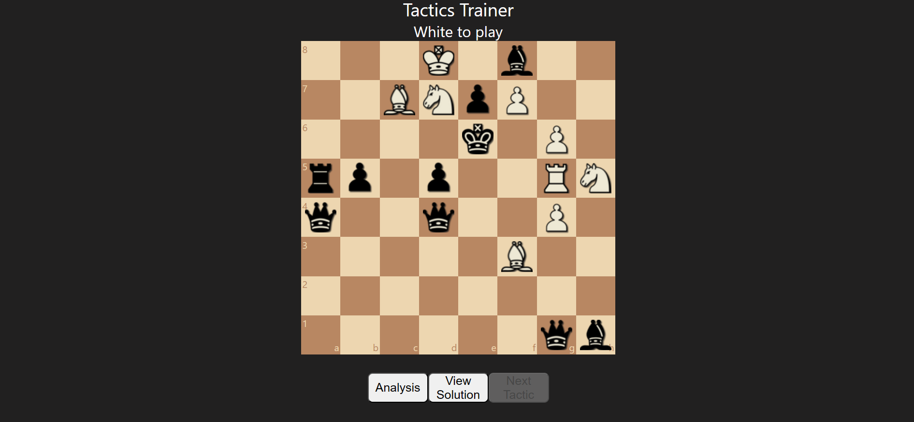

# Tactics Trainer

 A chess app desinged to improve your ability to identify and execute chess tactics.

#### Basics
* An easy to use tactics trainer made with the help of [chess.js](https://github.com/jhlywa/chess.js)
* Problems come from Laszlo Polgar's "Chess: 5334 Problems, Combinations and Games"
* Hit the **View Solution** button if you are stuck.
* After a solving or viewing the solution, you can **retry**, **analyze** on Lichess.org, or just go to the **next** tactic.

### Author
Adam Bridgers
